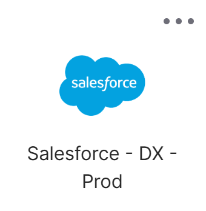
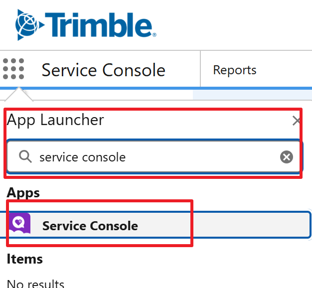

# Accessing Salesforce

!!! info "Accessing Salesforce"

    This guide outlines the standard procedure for logging in via Okta and navigating to the Service Console where support cases are managed.
     

    <h2 style="margin: 0; color: #005a8c; font-size: 1.5rem; font-weight: 300; border-bottom: none; padding: 0;">Steps</h2>

1. Navigate to your organization's [Okta dashboard](https://trimble.okta.com/){:target="_blank"}.
2. In the "My Apps" section, use the search bar to find Salesforce.
3. Click the Salesforce application icon to be securely logged in. The specific instance "Salesforce - DX-Prod".
	 
	{ width="30%" }
4. Once inside Salesforce, locate the App Launcher icon (a grid of nine dots) in the top-left corner.
5. Click the icon to open the search menu.
6. Type Service Console into the search bar and click to access it.
	 
	 
	{ width="30%" }