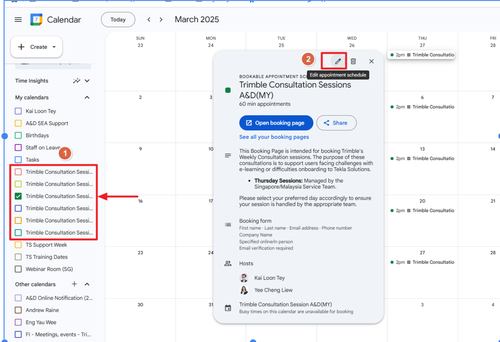
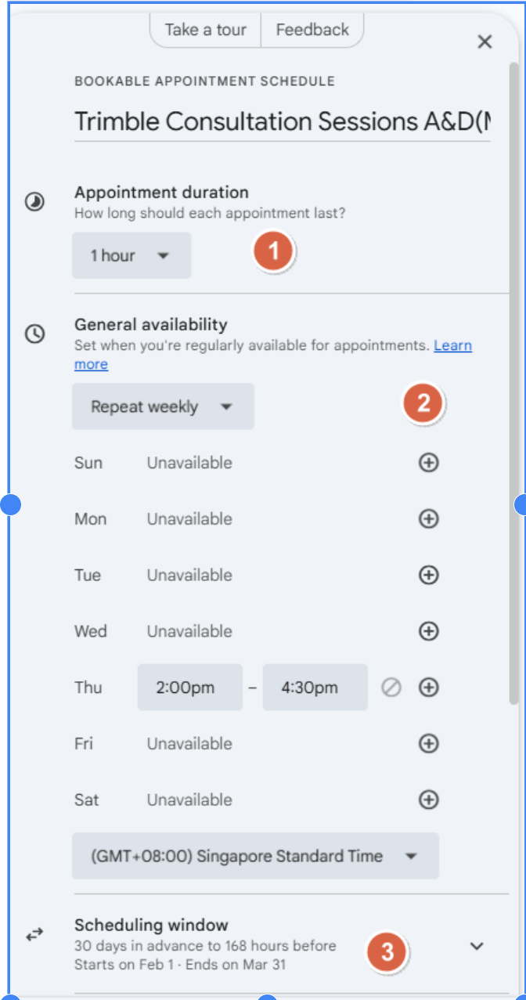
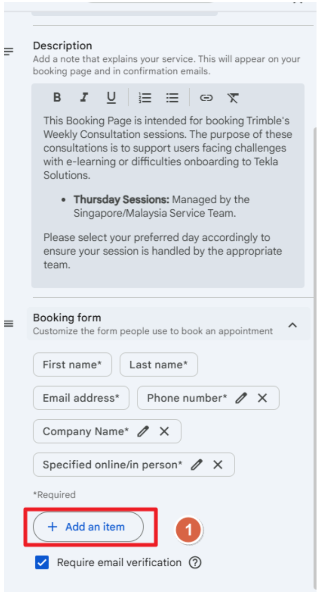

# Weekly TSEA Clinic Sessions

Providing tailored support and building stronger relationships with our customers.

As part of our strategic initiative to promote e-learning and self-guided learning for Tekla Products, we are excited to introduce **Weekly TSEA Clinic Sessions**. These 1-hour sessions are designed to build stronger relationships with new customers while providing tailored support during their implementation journey. 

Customers can connect with our service team to address specific challenges, discuss real-world application of e-learning content, and receive practical guidance to enhance their workflows.

---

!!!info "Session Management & Schedule"

	These sessions are tailored to support customers facing challenges with e-learning or onboarding Tekla Solutions.

	| Day | Team |
	| :--- | :--- |
	| **Tuesday** | Thailand Service Team |
	| **Wednesday** | Indonesia Service Team |
	| **Thursday** | SG/MY Service Team |

---
## Book a TSEA Clinic

Access the main portal or select the appropriate region below to view available slots and book a session.

!!! tip "Centralized Booking Portal"
    Visit the main TSEA Clinic Booking site to view all available regional and product-specific schedules in one place. 
    
	&rarr; **[Open Booking Portal](https://sites.google.com/trimble.com/tseaclinicbookingportal/trimble-sea-clinic-booking-portal)**

### Regional & Product Schedules

| Region / Topic | Description & Facilitator | Action |
| :--- | :--- | :--- |
| **Structural Design (MY/SG)** | Support for Tekla Structural Designer and Tedds. *(Facilitated by Yee Cheng)* | [View Calendar](https://calendar.google.com/calendar/u/0/appointments/schedules/AcZssZ1uxqYuoSedMv2BWoc-jgl8yzRiXbMQ7vXXRs736zX_Rd2Cq4R86ZpPNXi8u3AKUINXHL6dbqnl) |
| **Tekla Structures (MY)** | TSEA Clinic sessions for Tekla Structures users in Malaysia. *(Facilitated by Taufik)* | [View Calendar](https://calendar.google.com/calendar/u/0/appointments/schedules/AcZssZ03upu92Z2QJRAyQxzneMvJ-NsQ_2ins58Wlb1OnvqlwhlMn8pFSkcPr0Xo7mtAu3IJXZoIbltx) |
| **Tekla Structures (SG)** | TSEA Clinic sessions for Tekla Structures users in Singapore. *(Facilitated by Norman)* | [View Calendar](https://calendar.app.google/Twtui9CeFWgWU2r16) |
| **Thailand TSEA Clinic** | General TSEA Clinic sessions for customers in Thailand. *(Facilitated by Tawan & Wichai)* | [View Calendar](https://calendar.app.google/Mx9693KMARNLZXrZ7) |
| **Indonesia TSEA Clinic** | General TSEA Clinic sessions for customers in Indonesia. *(Facilitated by Yudhi)* | [View Calendar](https://calendar.app.google/X8vL5vqwqgxMozSM9) |

---

    <h2 style="margin: 0; color: #005a8c; font-size: 1.5rem; font-weight: 100; border-bottom: none; padding: 0;">Admin Guide: Editing Appointment Schedules</h2>

Instructions for facilitators to modify availability and session details.

## 1. Access & Modification
**Select the designated TSEA Clinic Session** from your Google Calendar view. Click on the **Edit button** (pencil icon) to modify the appointment schedule settings.

## 2. Configuration Settings
*   **Setting Appointment Duration:** Define the length of each session (e.g., 60 minutes).
*   **TSEA Clinic Day:** Determine the specific day of the week for the session (e.g., Tuesday, Wednesday, or Thursday).
*   **Booking Window:** Determine when the schedule starts and how far in advance a customer can book a Technical Session.

## 3. Additional Input
The default fields required are **Name, Phone, Email, and Company Name**. If additional specific information is required from the customer during the booking process, you can add custom questions here.

---

!!!info "Session Registration Tracking"

	**Registration Database**
	
	Access the Google Sheet recording companies that have registered for sessions.
	&rarr; [Open Google Sheet Tracker](https://docs.google.com/spreadsheets/d/1BoSCP3rqUiTEcGh4q2cEJN2tDRnq02NRAb39mi6LKwU/edit?gid=0#gid=0)