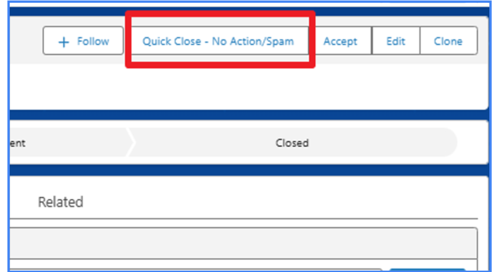

# Closing Support Cases

There are two main ways to close a case without a full resolution cycle: using the "Quick Close" action for non-support matters, or letting the automated "Go Dark" process handle unresponsive customers.

---

## "Go Dark" Process (Auto-Closing Cases)

This automated process closes a support case when the customer does not respond to a request for information.

## How the "Go Dark" Process Works

* **Day 1:** A support agent sets the case status to **Pending Customer Action** after requesting information from the customer.
* **Day 2:** The system sends an automated reminder email to the customer.
* **Day 4:** The system sends a final reminder email to the customer.
* **Day 5:** If there is still no response, the case is **automatically closed**. The case Sub-Status is updated to "No Customer Response".

## How to Prevent a Case from Auto-Closing

If you need to keep a case open while waiting for a customer but want to prevent the "Go Dark" process from running, you can manually intervene.

* Change the case **Sub-Status** to **On Hold**. This will pause the auto-closure timer.

!!! info "Keeping the Queue Clean"
    The **"Go Dark"** process ensures that the support queue remains clean and that cases do not stay open indefinitely while waiting for a customer reply.

---

	
!!! info "Quick Close"
	The **Quick Close** action should be used for cases that do not require a support resolution, such as sales queries, license compliance issues, or requests from off-maintenance customers. This action closes the case immediately without sending a survey.
	  
	  {width="50%"}