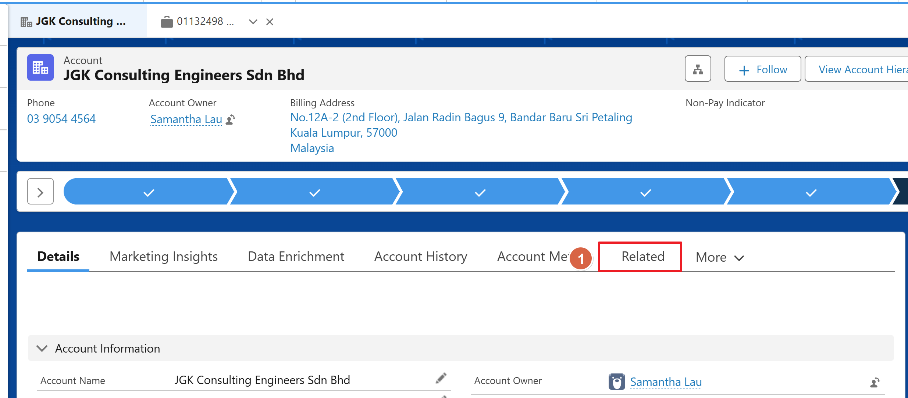
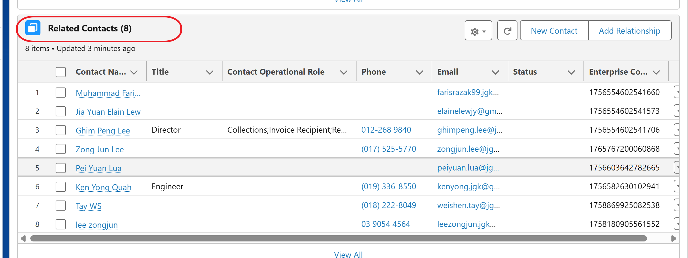

# Finding Contacts in Salesforce

A simple guide on how to locate a contact under a specific account using the Salesforce interface.

    <h2 style="margin: 0; color: #005a8c; font-size: 1.5rem; font-weight: 300; border-bottom: none; padding: 0;">Steps</h2>

1. Search for and open the specific account you want to inspect in Salesforce. Once the account page is loaded, click on the Related tab from the navigation menu on the record.

    

2. Scroll down through the page until you find the Related Contacts section. Here you will be able to view all the contacts tied to this specific account.

    
