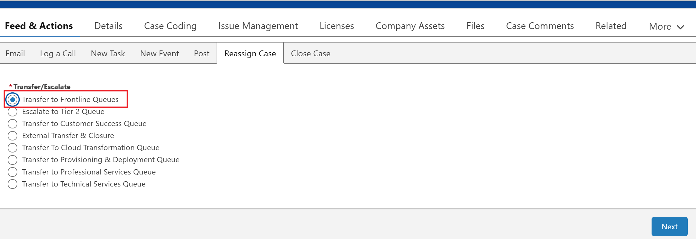

# Troubleshooting Resources - Internal (APAC)

Comprehensive list of internal contacts and procedures for administrative, sales, and technical issues within the APAC region.

---

## Internal Contacts & Categories

*   **Account Management:** For New Account Sync issues, email customer_master@trimble.com or apac-orders@trimble.com. For Name/Address changes, use the "Request Change" button on the Salesforce Profile.
*   **Orders & Licensing:** For Orders Not Processed (India), email mei_orders@trimble.com. For the Deal Desk, email apac-deal-operations@trimble.com.
*   **Financials & Billing:** For Tax Questions, email VAT_Global@trimble.com. For Escalated Collections, email credit_collection_apac@trimble.com.
*   **Legal & Compliance:** For EEUC Form Submissions (APAC), email ARFC_export@trimble.com. For Legal Admin, email tebv_legaladministration@trimble.com.
*   **Payments & Vendors:** For Cash Apps/Payments, email TEBV_cashapps@trimble.com. For Vendor Portal Support, email us_arportalinvoices@trimble.com.
*   **Quick Support:** For all other general queries, contact trimble-support@trimble.com.

---

## Salesforce Reassignment Workflow

**Visual representation of the Salesforce Reassignment UI.**

 
	
**Execution Steps**
 
1. **Trigger Ownership Change:** Click the **Change Owner** button on the top-right header of the Case record.
 
2. **Select Global Queue:** Search for exactly **Global Horizontal Support** in the Queue search bar. Be sure to check the "Send Notification Email" box before saving.
	
---

!!! Tip 
	**Escalation Recommendation & Critical Check**
	 
	If you are unsure of the next steps or if an issue requires technical intervention, reassign the case to **Global Horizontal Support**. 
 
!!! Note
	**Important:** Before transferring, ensure all communication history is logged in the "Case Comments" section. For APAC cases, strictly denote the urgency level if there is a pending order block.
