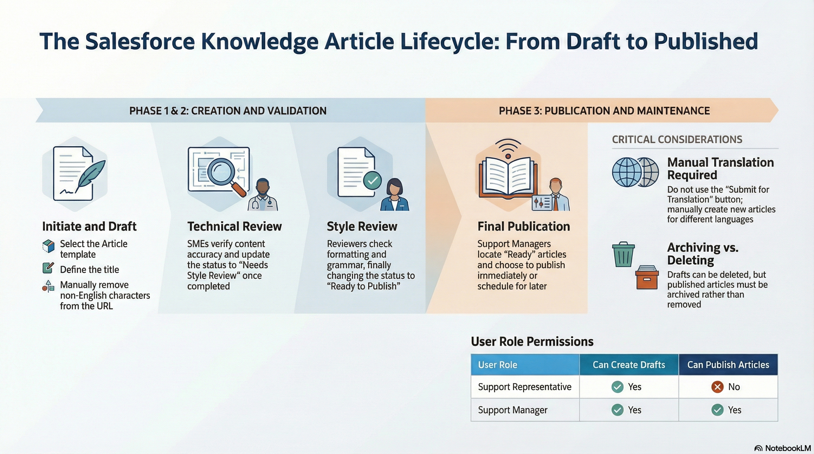

# Creating Knowledge Articles

Support Agents can draft articles, assign for technical and style review, and update validation statuses until publishing. This guide outlines the mandatory fields and validation workflow required for the Salesforce integration.

---

## Interface Overview

### 1. Knowledge Article Workflow

### 2. Structure SEA List View
Select the **Structure SEA Support** list view to see all articles relevant to the team. Pin this view for easy access. 

**[Access Salesforce Knowledge Article ListView](https://trimbledx.lightning.force.com/lightning/o/Knowledge__kav/list?filterName=00BPO00000DcEk52AF)**

---

## Field Definitions & Requirements

* **Title (Mandatory):** Visible in the article. Character limit of 255 applies when creating or editing within Salesforce.
* **URL Name (System):** Auto-populated based on title. Manually remove non-English characters (e.g. Ä, Ö) to avoid save errors.
* **Product Category (Classification):** Select the applicable Product(s). While not technically compulsory, it is a required best practice.
* **Summary (Content):** Content of this field will be visible when an article is published in the Support Center.
* **Validation Status (Status):** Tracks progress: Draft &rarr; Needs Technical Review &rarr; Needs Style Review &rarr; Ready to Publish.
* **Visibility (Settings):** Controls access: "Internal App" (Salesforce only), "Public Knowledge Base" (Unauthenticated), or "Visible to Customer".
* **Language (Settings):** Select from drop-down. Cannot be changed after saving. Customers only see articles matching their preferred language.
* **Internal Notes (Internal):** Use this field for information intended only for internal support staff.

---

!!! warning "Critical Warning: Translations"
	The **"Submit for Translation"** button and the **"Translation Actions"** functionality visible in the Salesforce Productioninstance should **NOT** be used at this time. These features require redesign. If an article needs to be published in more than one language, manually create a new article, set the Language correctly, and translate the content manually.

---

!!! info "Deleting vs. Archiving"
	Only unpublished **Drafts** can be deleted (cannot be recovered). A published article must be set to **Archived** status using the Archive button. Archiving an article automatically archives any linked translations.
## Creation & Review Workflow

    <h2 style="margin: 0; color: #005a8c; font-size: 1.5rem; font-weight: 300; border-bottom: none; padding: 0;">Steps</h2>

1. **Initiate Draft:** Navigate to the **Knowledge** object in the menu. Click **New from Template**. Ensure you have the 'Support Rep' or 'Support Manager' role.
2. **Select Template:** Select **Article** as record type and click Next. Enter a **Title**, then choose *External Article* (Customer visible) or *Internal Article* (Staff only).
3. **Populate Data:** Fill in all fields marked with a red asterisk (*). Note that **URL Name** auto-populates (remove special characters like Ä/Ö). Click **Save**.
4. **Technical Review:** Set Validation Status to **Needs Technical Review**. Assign to an SME or review yourself. Once complete, check **Technical Review Done**.
5. **Style Review:** Set Validation Status to **Needs Style Review**. Ensure correct formatting, grammar, and terminology. Once complete, check **Style Review Done**.
6. **Publishing:** Set Validation Status to **Ready to Publish**. Assign to a Publisher. The Publisher reviews the draft and clicks **Publish**.