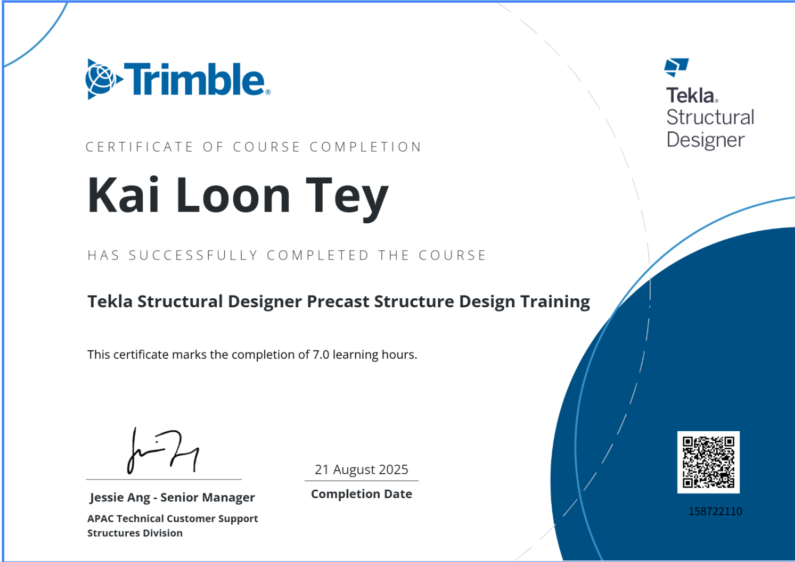

# Digital Credential Quiz Guide

Creating a quiz for the purpose of issuing digital credentials. Once the quiz is completed, participants will receive their digital credential via email automatically.

---

## Process Overview

This workflow streamlines the certification process by integrating quiz results directly with our credentialing system. It ensures that successful participants receive immediate recognition for their skills.

## Key Features
* **Automated Issuance:** Credentials are sent via email instantly upon passing.
* **New Format:** Certificates now include the **Duration** of the training.
* **Verification:** Digital credentials can be easily verified online.

---

## Sample Certificate

{width="50%"}

*\*New Format with Duration*

---
!!! info "Reference Materials & Guides"
    * **[HQ Tekla Assessment & Accreditation Framework](https://docs.google.com/presentation/d/17nbqZYreUE-EFaOJzHuzUiKm2Ype2rb9KPYZBq_FVCQ/edit#slide=id.g2ea4bc0a924_0_6555){:Target="blank"}**
      
		Refer to **slides 25-33** for detailed instructions on setting up the assessment.
      
    * **[Accredible Guide](https://docs.google.com/presentation/d/1txcxPlGVgicutqIdjyAMZ5ljTIg7fMd6-z02-XgsTew/edit?slide=id.g35a45b061bc_0_13497#slide=id.g35a45b061bc_0_13497){:Target="blank"}**
      
		Comprehensive documentation for digital credential management.