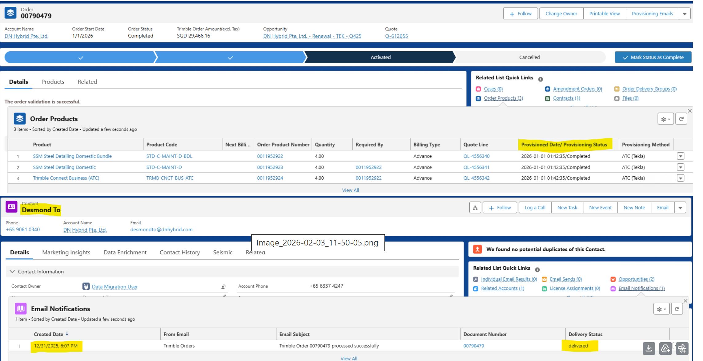

# License Delivery Verification

A step-by-step guide to confirming software license fulfillment across Salesforce, Tekla Admin Tools, and CRM Dynamics 360.

---

## Salesforce Proof of Delivery

## Primary Verification Sources

* **Primary (Salesforce CPQ):** Check the 'Order Products' related list for automated delivery status and timestamps under 'Provisioned Date'.
* **Organization View (Tekla Admin Tool):** Verify if the license has reached the customer organization at [account.tekla.com](https://account.tekla.com/).
* **Legacy/Contract (CRM Dynamics 360):** Used for cross-referencing legacy contracts or enterprise accounts not yet migrated to full CPQ automation.

> **Understanding "Delivered" Status**
> When an order is completed, the system triggers an automated email. In Salesforce, navigate to the **'Email Notifications'** section. If the **'Delivery Status'** is marked as 'delivered', the customer has officially received the license fulfillment notice. Always verify the recipient email matches the primary contact listed on the account.

---

    <h2 style="margin: 0; color: #005a8c; font-size: 1.5rem; font-weight: 300; border-bottom: none; padding: 0;">Verification Workflow</h2>

**Execution Steps**

1. **Search Order (Salesforce):** Search for the Order Number. Go to **'Order Products'** and look for **'Provisioned Status'** = 'Completed'.
2. **Confirm Contact Email:** Check **'Email Notifications'**. Verify the 'Delivery Status' is **delivered** and sent to the correct customer contact.
3. **Unsure? Check Tekla Admin:** If Salesforce data is ambiguous, log in to the Tekla Admin portal to check the organization's current license pool. ([Open Tekla Admin](https://account.tekla.com/))
4. **Validate in Dynamics 360:** Finally, perform a secondary check in CRM Dynamics 360 to ensure contract alignment and billing synchronization.

---

## Sample Provisional Emails

* **New Order:** [View Sample Email](assets/ProvisionalEmailSample_Neworder.png)
* **Amendment:** [View Sample Email](assets/ProvisionalEmailSample_amendment.png)
* **Renewal:** [View Sample Email](assets/ProvisionalEmailSample_Renewal.png)

---

## 2026 Version Updates (Legacy CRM)

> **Notice:** 2026 version updates have been made to legacy CRM systems. For detailed internal discussions, refer to the [CRM Happeo Channel](https://app.happeo.com/channels/99549188/CRM/discussion/78679656).

## Important Guidelines

* Version entitlements are linked to **perpetual licenses** (not subscriptions).
* Entitlements are **created and sent from MS Dynamics**, not from DX Salesforce.
* They are **not automatically created and sent** as part of the renewal process at the year end.
* Version entitlements are sent to customers by regional staff, and recipients are defined in MS Dynamics.
* **Prerequisite:** 2026 entitlements for Tekla Structures cannot be created if entitlements for previous years have not been created first.
* **DX Salesforce** contains information on the customer’s maintenance status (e.g. SSM lines under Company Assets) but does not track if version entitlements have been created or sent.
* Entitlements for missing older versions, as well as **broken, lost, or replacement licenses**, are created by Tekla Orders in Finland ([tekla.orders@trimble.com](mailto:tekla.orders@trimble.com)).

!!! info "Regional Order Admin (OA) Contacts"

	Version entitlements are typically created by the regional order admin team. If you don’t know who to contact, local OA managers can help:

	| Region | Contact Email(s) |
	| :--- | :--- |
	| **APAC (excluding China)** | [apac-orders@trimble.com](mailto:apac-orders@trimble.com) [Orapan_Kleedit@trimble.com](mailto:Orapan_Kleedit@trimble.com) |
	| **India** | [Ashvini_Sowmiya@trimble.com](mailto:Ashvini_Sowmiya@trimble.com) |
	| **DACH and UK** | [jenni_isliker@trimble.com](mailto:jenni_isliker@trimble.com) |
	| **France** | [elsa.dacosta@trimble.com](mailto:elsa.dacosta@trimble.com) |
	| **Brazil and US** | [JohnPatrick_LaRiviere@trimble.com](mailto:JohnPatrick_LaRiviere@trimble.com) |
	| **Nordics, China, ME (incl. Israel) & Indirect** | [camilla.brander@trimble.com](mailto:camilla.brander@trimble.com) |

---

## Frequently Asked Questions

??? faq "Who should we approach regarding renewals or replacement licenses?"
    Contact the appropriate team based on the specific license need:
    
    * **Missing older versions, Broken, Lost, or Replacement FlexNet Licenses:** Email Tekla Orders in Espoo at [tekla.orders@trimble.com](mailto:tekla.orders@trimble.com).
    * **2026 Perpetual FlexNet Delivery:** This will transition to regional OA teams (e.g., APAC orders / Hnon's team) once training is complete. Until then, please refer to your local OA manager.

??? faq "Where can we check license entitlement status?"
    FlexNet license statuses can be viewed within the **MS CRM License Base** and the **License Entitlement Base**, following a process similar to the pre-DX workflow.
    
    > **Important Note:** An updated maintenance date in ATC does **not** guarantee that the license entitlement has been created or shipped. You must always verify the entitlement specifically within CRM.

??? faq "If the entitlement is missing in CRM, who should we verify with?"
    Please contact your **Regional Order Admin (OA) team** first. If the missing entitlement relates to older versions or a broken/lost/replacement license, escalate to **Tekla Orders in Espoo**.

??? faq "For renewal or replacement cases in CRM, who physically delivers the license?"
    These licenses should be delivered **locally** by regional staff. The Espoo team typically does not have visibility into specific, localized agreements made directly with the customer.

??? faq "What is the process for 2026 license entitlements?"
    Regional OA teams are currently being trained to handle this delivery (a task previously managed by salespersons before DX). For example, in the APAC region, this responsibility will officially shift to **Hnon's team** following the completion of their training.

!!! note "Helpful Resources:"
	* [Detailed Process Doc](https://docs.google.com/document/d/1ZvskbFgvUOc8XNR_y3nASADqVluF9hWiy0QED8O-ZJ4/edit?tab=t.0)
	* [Entitlement Delivery Guide](https://docs.google.com/document/d/1gMOe-0bt_nGZIVJ8IjPfn8kNPB7VgtiGqHNHYadZRkQ/edit?tab=t.0#heading=h.h7edm9nw0hkd)