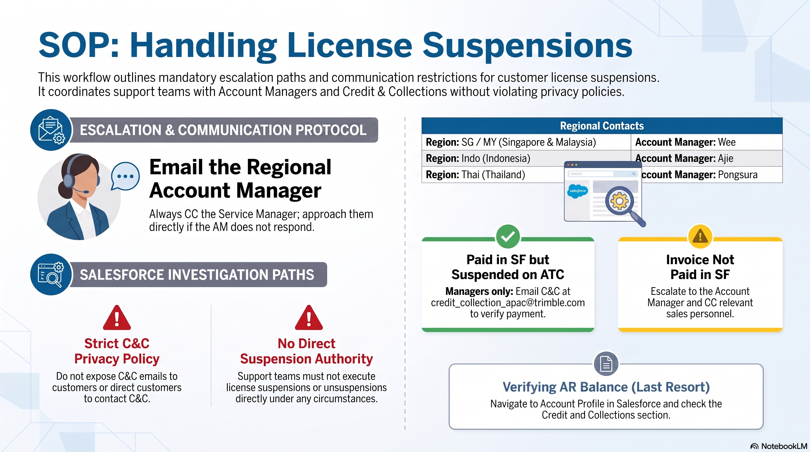

# Handling License Suspensions

Standard Operating Procedure for the Support & Service Management Team. Adherence to these policies is mandatory and for internal circulation only.

---

## Workflow Overview

---

    <h2 style="margin: 0; color: #005a8c; font-size: 1.5rem; font-weight: 300; border-bottom: none; padding: 0;">Steps</h2>

## 1. Escalation Protocol (Country & Account Owners)

> **ACTION REQUIRED:**
> ALWAYS email the relevant **Country Manager** (listed below) **AND** the **Account Owner (Seller)** for the customer's region.
> 
> **MANDATORY CC:** Service Manager & Renewal Specialist (Naim) &rarr; [nadzmi_naim@trimble.com](mailto:nadzmi_naim@trimble.com)

### Country Managers
* **SG / MY:** Wee ([engyau.wee@trimble.com](mailto:engyau.wee@trimble.com))
* **INDO:** Ajie ([ajie.pamadaraji@trimble.com](mailto:ajie.pamadaraji@trimble.com))
* **THAI:** Pongsura ([pongsura.angkananuchat@trimble.com](mailto:pongsura.angkananuchat@trimble.com))

> **UNRESPONSIVE? (Escalate)**
> If the Account Owner does not respond in a reasonable timeframe, approach the Service Manager directly.

---

## 2. CRITICAL: Credit & Collections (C&C) Policy

**STRICT RESTRICTIONS REGARDING C&C**  
The following actions are strictly prohibited to ensure proper procedural flow and avoid miscommunication:

* **DO NOT** expose the C&C team email to customers, as this is meant strictly for internal communication.
* **DO NOT** forward cases containing customer emails to the C&C team.
* **DO NOT** direct customers to contact C&C themselves.
* Support teams **MUST NOT** execute license suspensions or unsuspensions directly under any circumstances.

---

## 3. Internal Salesforce Checks

> **Service Managers Reference Only**
> When investigating suspension status within Salesforce (SF), follow these escalation paths based on the invoice status:
> 
> * **Invoice Paid in SF but Suspended on ATC:** Email the C&C team at [credit_collection_apac@trimble.com](mailto:credit_collection_apac@trimble.com) (Strictly for Managers); they will verify the payment.
> * **Invoice NOT Paid in SF:** Escalate the issue directly to the Account Owner and ensure that the relevant sales personnel are CC'd on the communication.

### Exception Path: Strictly for Managers
If a customer's license **has been paid but they remain suspended** on ATC, managers may escalate directly to Credit & Collections.

**C&C Team Contact:** 
[credit_collection_apac@trimble.com](mailto:credit_collection_apac@trimble.com)

---

## 4. Checking AR Balance
*C&C Information (Last Resort Only)*  
In rare circumstances where absolute verification is needed, you may check the AR Balance.

1. **Navigate to Salesforce:** Log into your internal portal and open the Salesforce (SF) dashboard application.
2. **Account Profile:** Search for and go to the specific Account Profile relevant to the customer inquiry.
3. **Check Balance:** Check the "Credit and Collections" section specifically looking for the current AR Balance.

### Reference Cases
* [Case 01716823](https://trimbledx.lightning.force.com/lightning/r/Case/500PO00000jGLjMYAW/view?ws=%2Flightning%2Fr%2FAccount%2F001PO00000Ts9MBYAZ%2Fview)
* [Case 01710460](https://trimbledx.lightning.force.com/lightning/r/Case/500PO00000j5XT6YAM/view?ws=%2Flightning%2Fr%2FAccount%2F0017V00001y5filQAA%2Fview)