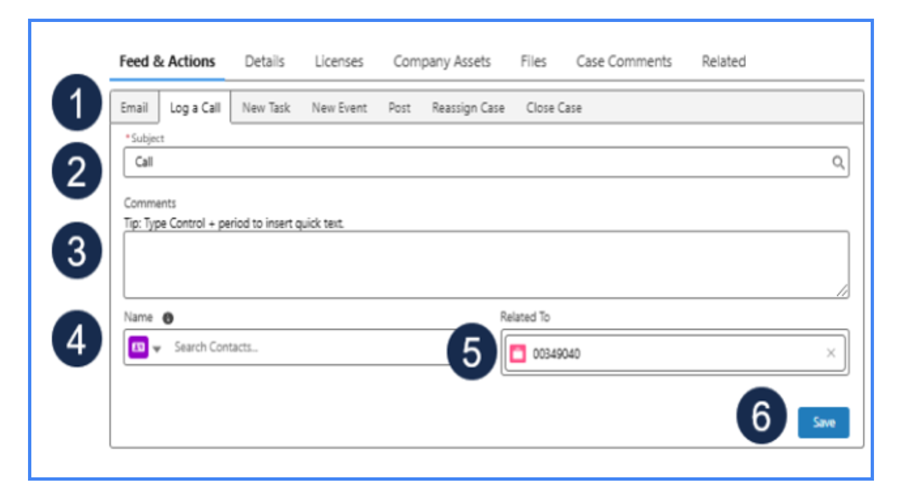
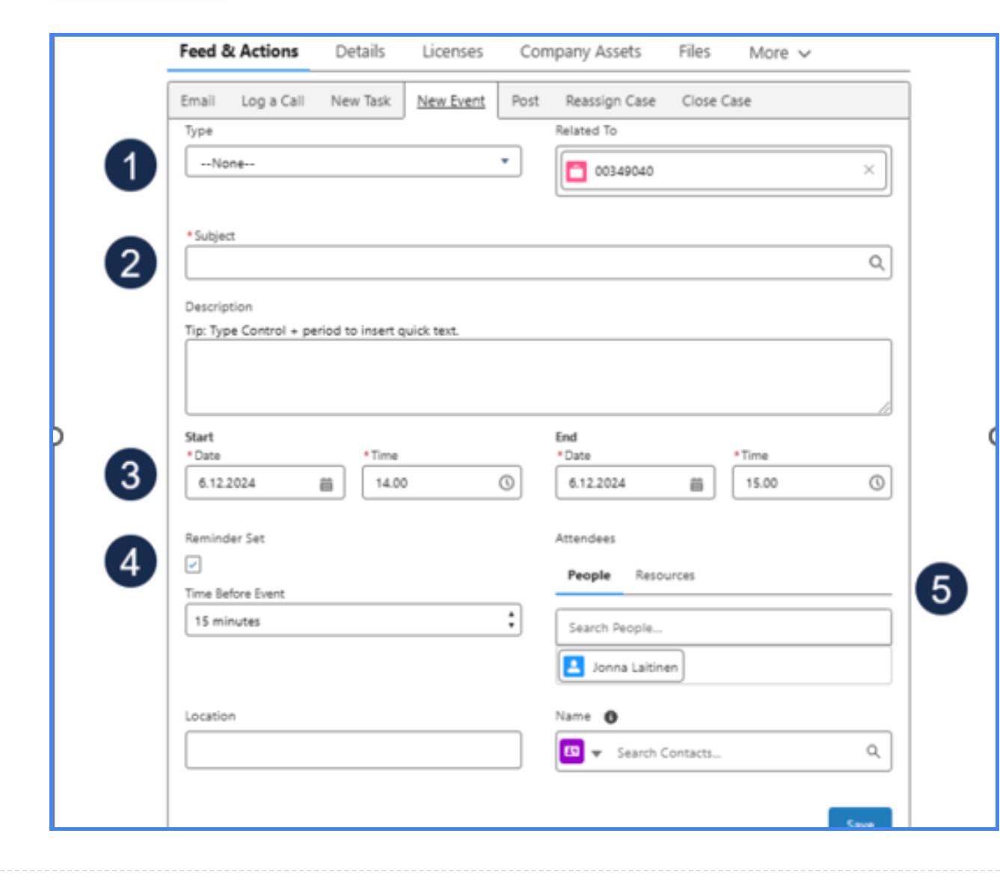

# Log a Call or Event

Recording interactions is essential for case history and tracking. Learn how to correctly log "meaningful interactions" on a case.

---

## Log a Call

Use the **Log a Call** feature when a phone call with the customer is required to discuss the case. This is used to document both inbound and outbound calls.

1. On the case page, navigate to the **Feed & Actions** tab.
2. Click the **Log a Call** action.
3. Enter a **Subject** for the call and detailed notes in the **Comments** section.
4. Ensure the **Correct Contact** is associated with the call log.
5. Click **Save**.

{width="50%"}

---

## Create a New Event

Use the **New Event** feature to schedule and record activities like a **TeamViewer/Zoom session** or an **online consultation**. Events have a defined start and end time.

1. On the case page, navigate to the **Feed & Actions** tab.
2. Click the **New Event** action.
3. Fill in the **Subject**, **Description**, and set the **Start/End Date and Time**.
4. Add any relevant **Attendees** (internal staff and customer contacts).
5. Click **Save**.

{width="50%"}

---

!!! info "Why Log Activities?"
    Logging calls and events provides a complete timeline of interactions, helps other team members understand case progress, and contributes to key support metrics.