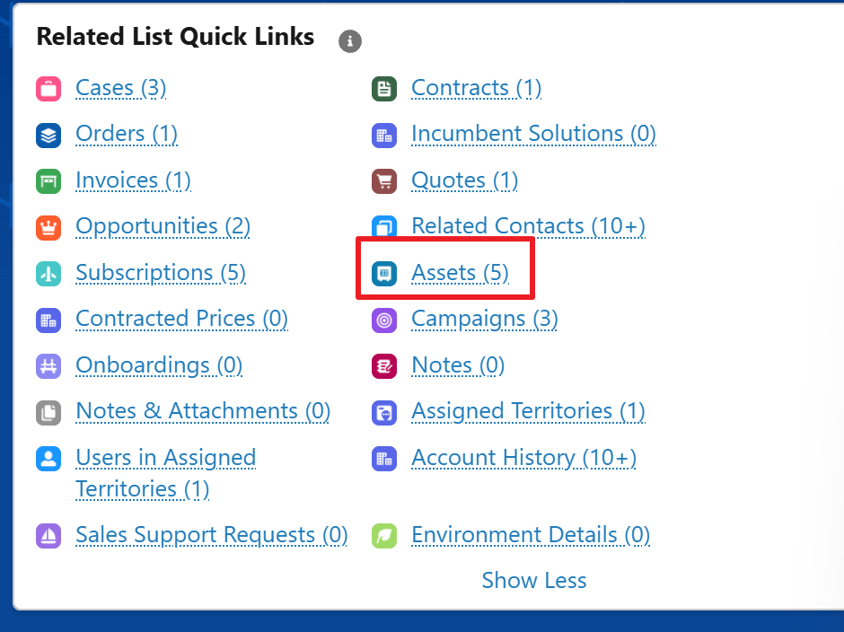
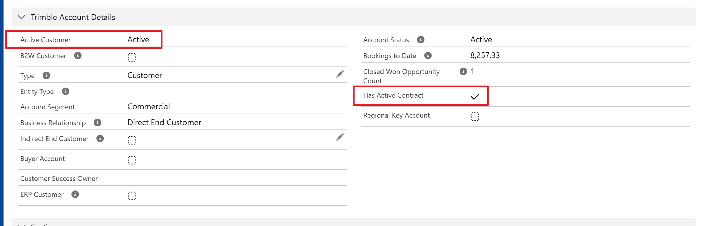
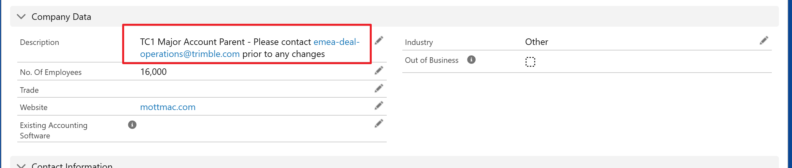
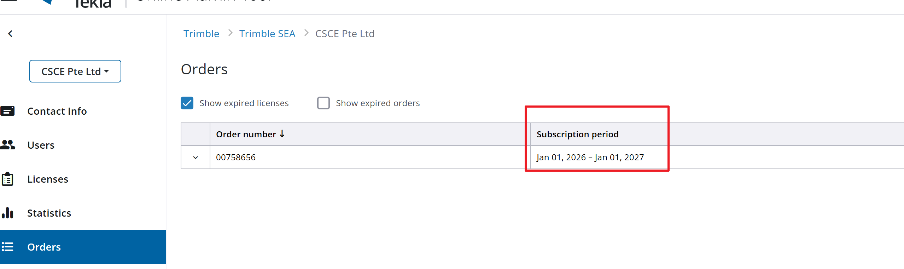

# Maintenance Status Verification Guide

This guide outlines the procedures for verifying a customer's maintenance and active contract status across various Trimble and Tekla platforms. Ensure you check these systems to confirm an account is active before proceeding with support or services.

---

## 1. Salesforce (SF) Asset Verification

The primary method for checking maintenance status is through Salesforce Assets.

1.  Navigate to the relevant Account page in Salesforce.
2.  In the right-hand sidebar, locate the **Related List Quick Links** section.
3.  Click on **Assets** to view the customer's current products and their status.

{width="50%"}

---

## 2. Salesforce Account Details & Company Data

You should also review the general account details to confirm their active status and check for any special handling requirements.

### Trimble Account Details

1.  On the Account page, scroll to the **Trimble Account Details** section.
2.  Verify the following fields:
    *   **Active Customer:** Should be marked as "Active".
    *   **Has Active Contract:** Should be checked.

{width="80%"}

!!! info "Company Data & TC1 Major Accounts"

    1. Scroll down to the **Company Data** section on the Account page.
    2. **Crucial Check:** Look at the **Description** field. If the account is flagged as a **TC1 Major Account Parent**, you **must** follow the specific instructions provided (e.g., contacting `emea-deal-operations@trimble.com` prior to any changes).

    

---

## 3. Tekla CRM (Legacy)

For certain historical or regional data, you may need to consult the Tekla CRM.

*   **Access Link:** [Tekla BC APAC CRM](https://a-crmapac.teklaad.tekla.com/TeklaBCAPAC/main.aspx){: target="_blank" } *(Ensure you are on the VPN/network if required).*

---

## 4. Tekla Online Admin Tool (ATC) - Order Verification

To verify specific subscription periods and online licenses, use the Tekla Online Admin Tool (account.tekla.com).

1.  Log in to the Admin Tool and navigate to the customer's organization.
2.  Select the **Orders** tab on the left navigation menu.
3.  Review the **Subscription period** column to confirm the active dates for their orders.

{width="80%"}

---

## 5. Multi-Year Accounts Google Sheet

For tracking accounts with multi-year agreements, reference the centralized tracking sheet.

*   **Access Link:** [Multi-Year Accounts Tracking Sheet](https://docs.google.com/spreadsheets/d/1JgodoB1Chv9aCUTx354Q6XNFh9sH2IjI_NrnhnAi6zE/edit?gid=0#gid=0){: target="_blank" }