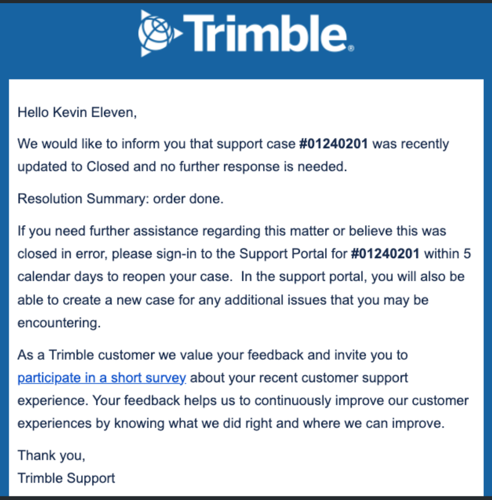
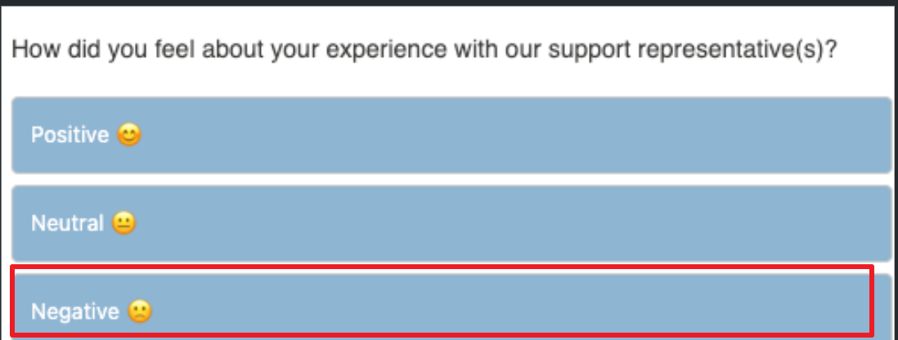
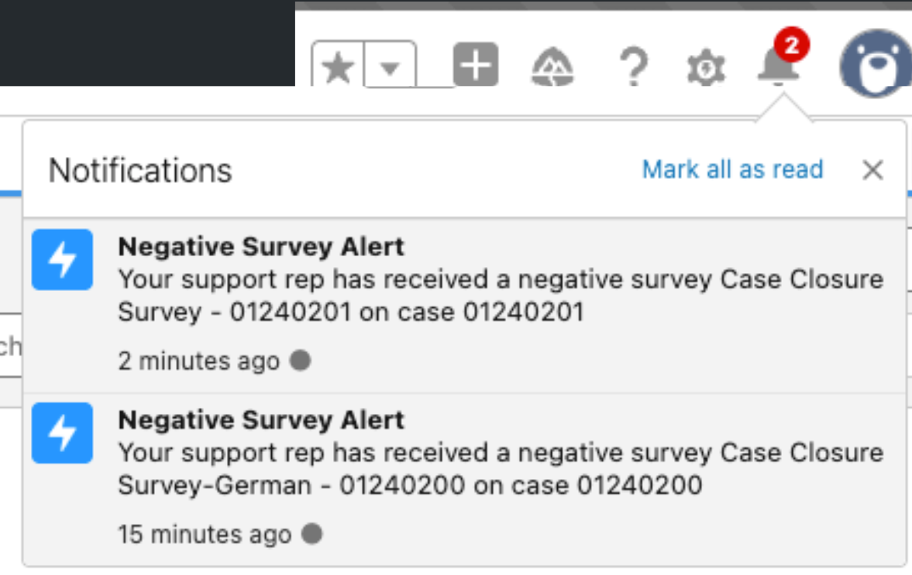

# Auto Notification & NPS Survey

Understanding Trimble's customer feedback process and automated communication workflows.

## Automated Notifications

Customers receive automated emails at key moments in a support case to keep them informed:

* **Case Opened:** An email is sent when a case is opened and assigned to our team.
* **Awaiting Reply:** If we are waiting for a reply, reminders are sent for a few days before the case is automatically closed.
* **Issue Escalated:** An email is sent when an issue is forwarded to our product development team.
* **Case Closed:** When the case is closed, a final email is sent which includes a link to the NPS satisfaction survey. (Note: A survey is not sent for a "quick close".)

!!! info "Language Preference:"
	If a contact exists in Salesforce with a 'Preferred Language' set, they will always receive support notifications in that language.

## About the NPS Survey

The NPS (Net Promoter Score) Survey is a crucial tool for gathering feedback. The survey link is included in the 'Case Closed' email notification when a case's sub-status is one of the following:

* Solution Completed
* Solution Offered
* Answered by Community
* Customer Closed
* No Customer Response
* No Resolution

!!!note "Note"
	Any other values, such as **Duplicate** or **No Action/Spam**, will **not** trigger a survey link.
	
	If Case Sub-Status equals:

	* **Issue Management**
	* **Customer Closed**
	* **External Transfer** 

	or Case Resolution contains:

	* **Transfer** 

	The customer still gets the case closed notification, but it **does not** include the survey invite.

!!! warning "Updated Exclusion Rules (Service Blazers Q1 2026)"
    Case Closure email alerts have been updated. The survey link will **not** be sent in the following scenarios:
    
    * **Case Sub-Status equals:** `Issue Management`, `Customer Closed`, `External Transfer`, `Duplicate`, or `No Action/Spam`.
    * **Case Resolution contains:** `Transfer`.
When the link is clicked, a new tab opens with a welcome message, followed by the survey questions.

---

## Survey Questions

{width="50%"}

The survey consists of:

* **1x NPS question:** "How likely are you to recommend Trimble to a colleague or friend?"
* **1x Customer Effort Score question:** "Overall, how easy was it to get the help you wanted?"
* **1x Sentiment question:** "How did you feel about your experience with our support representative?" (Positive/Neutral/Negative)
* **1x Free text field:** For further comments and detailed feedback.

Once submitted, the recipient is directed to a confirmation message.

---

## Survey Response Action

!!! warning "Negative Feedback Routing"
    If a customer selects **'Negative'** in response to their experience, the system automatically triggers two actions:
    
	{width="50%"}
	
	---
	
	1. A notification is sent directly to the support representative's manager.
    2. A coaching opportunity record is created in Salesforce.

!!! info "Real-Time Manager Notifications"
    A custom notification, referencing the survey and case IDs, appears on the bell icon for the support manager in real-time. 
    
    Clicking on the notification takes the manager directly to the survey record, where they can easily find the associated Case link for further investigation.
    
    { width="40%" }

## How to Check Survey Responses (Per Case)

You can find feedback directly in the associated case. This must be checked manually. Follow these steps:

1. **Navigate to the Case:** Open the specific case you wish to check.
2. **Select 'Related':** Click the **More** tab and then select the **Related** tab to see associated records.
3. **Find Survey Section:** Scroll down until you see the 'Survey Invitations and Responses' section.
4. **View Responses:** Click on the Invitation Record, select the **Related** tab again within the pop-up, and then select the drop-down arrow next to the completed survey to **View Responses**. This will show the participant's answers.

## Creating a Survey Report

To build a report for viewing all customer support survey responses your team has received, follow these steps:

1. **Navigate to Reports:** Go to the **Reports** menu in the Service Console and select **New Report** in the top right corner.
2. **Select Report Type:** Start typing 'survey' into the search bar and select the **Cases with Survey Responses** report type when it appears.
3. **Start Report:** Click the **Start Report** button.
4. **Add Filters (Recommended):** We recommend adding filters to make it easier to identify data or trends. You can group the survey responses by Case Support Team, Case Owner, or Case Number.

!!! note "Further Information"
    For complete details on the updated Case Closure email alerts and survey logic, please refer to **Slide 41** of the [Service Blazers Q1 2026 User Guide](https://docs.google.com/presentation/d/1wCW2VUsj2xZI5vs1Py89zJqggIg60ApTuVv9Fvz5Kuk/edit?slide=id.g3c307ba50bd_0_84#slide=id.g3c307ba50bd_0_84).