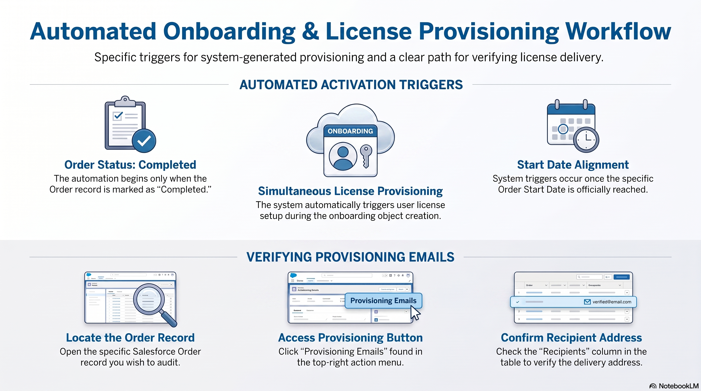

# Automated Onboarding and License Provisioning Guide

Understanding the system triggers for automatic onboarding object creation and how to verify license provisioning emails in Salesforce.

---

## Workflow Overview

---

!!! info "Onboarding Object Triggers" 

	**Condition 1 - Order Completed:**
	 
	The Order Status on the Salesforce record must be explicitly set to **Completed**.
	 
	**Condition 2 - Start Date Reached:** 
	 
	The Order Start Date specified on the record must have been **reached**.
	 
	**System Action - Object Creation:**
	 
	Once conditions are met, an onboarding object item is automatically generated by the system.
	 
	**System Action - License Provisioning:**
	 
	The Salesforce system simultaneously triggers the license provisioning process for the user.

	!!! info "Automated License Provisioning"
		Simultaneously with the onboarding object creation, the Salesforce system automatically triggers the license provisioning process for the user. Both of these actions are handled entirely by the system once the required conditions are met.

---

## Verification Process

!!! tip "Double-Checking Deliveries"
    If you need to verify who received the license setup instructions, you do not need to check external systems. The verification can be completed entirely within the Salesforce Order record interface.

    <h2 style="margin: 0; color: #005a8c; font-size: 1.5rem; font-weight: 100; border-bottom: none; padding: 0;">How to Verify Provisioning Email Recipients</h2>

1. **Locate the Record:** Open the specific Order record in Salesforce.
2. **Access Provisioning Emails:** Click the **"Provisioning Emails"** button located in the top-right action menu of the record.
3. **Verify Recipients:** Look under the **"Recipients"** column in the resulting table to verify the exact email address the provisioning email was sent to.