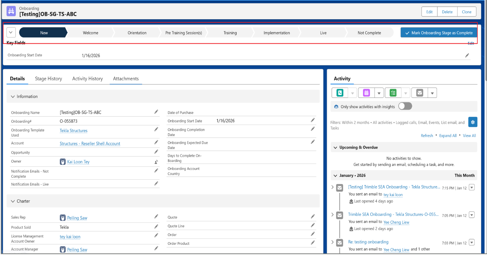
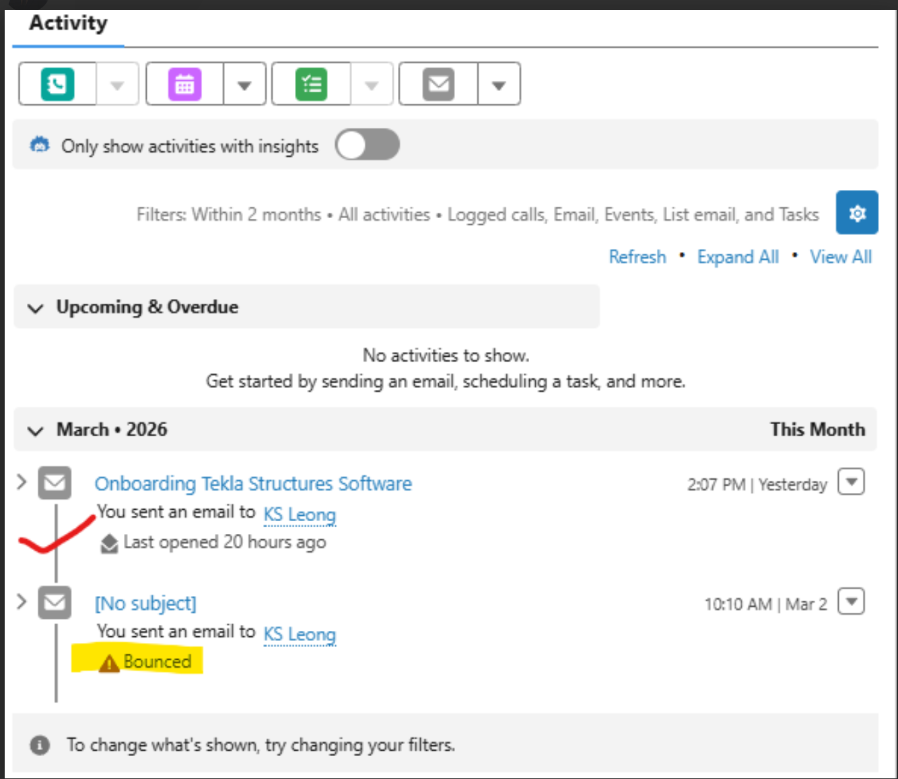
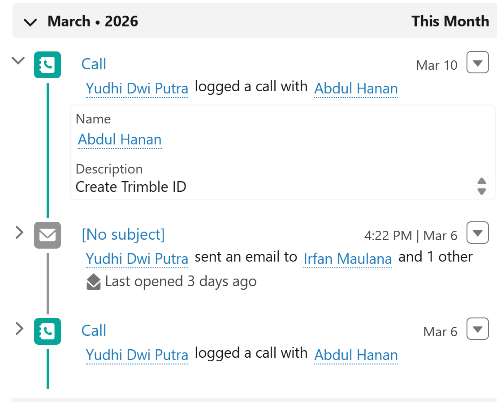

# Working on Onboarding Items

Understanding the customer journey through Salesforce onboarding stages.

---

## Onboarding Lifecycle Pipeline



!!!note "Stage Definitions"

	| Stage | Name | Definition |
	| :--- | :--- | :--- |
	| **Stage 01** | **New** | When the onboarding object is first created before anything has been done. |
	| **Stage 02** | **Welcome** | Once first contact has been made with the customer, and the onboarding person has introduced themselves. |
	| **Stage 03** | **Orientation** | Helping set things up for the customers. |
	| **Stage 04** | **Pre-Training Session(s)** | Getting things ready for their training. |
	| **Stage 05** | **Training** | Once Training is being delivered. |
	| **Stage 06** | **Implementation** | Helping them implement the software into their business. |
	| **Goal** | **Live** | Onboarding complete. |
	| **Exception** | **Not Complete** | Onboarding on-hold/postponed or cancelled. |

!!! tip "Process Flexibility"
    The stages used will vary between customers, depending on their requirements and what Sales has agreed to provide to them. You don't have to use every stage, so you can skip ones that don't apply.

---

## How to Work on a Case

<video controls style="width: 100%; max-width: 800px; border-radius: 8px; border: 1px solid #e2e8f0; box-shadow: 0 4px 6px rgba(0,0,0,0.05); margin-bottom: 20px;">
    <source src="https://sgmyserviceguide.trimblesea.com/InternalGuide/Salesforceonboarding_Workoncase1.mp4" type="video/mp4">
    Your browser does not support the video tag.
</video>

!!! warning "Important Note"
    Currently, "Customer replied" does not track inside the Salesforce onboarding object. Please check your inbox regularly.


<div style="background-color: #f4f7f9; border-left: 8px solid #005a8c; padding: 10px 20px; margin-top: 30px; margin-bottom: 20px;">
    <h2 style="margin: 0; color: #005a8c; font-size: 1.5rem; font-weight: 100; border-bottom: none; padding: 0;">Workflow Steps</h2>
</div>


1. **Locate the Record:** Navigate to the **Onboarding tab** in your main navigation bar, or use the quick links below. Select the specific Onboarding Object from the list view to open the record.
    * &rarr; [SEA Onboarding List](https://trimbledx.lightning.force.com/lightning/o/Onboarding__c/list?filterName=SEA_Onboarding1)
    * &rarr; [Onboarding Dashboard](https://trimbledx.lightning.force.com/lightning/r/Dashboard/01ZPO00000Oy1WT2AZ/view?queryScope=userFolders)

2. **Verify Details:** Click on the **Details tab**. Review key fields to ensure the onboarding data is current and accurate.

3. **Log Activities:** Go to the **Activity panel** on the right side of the page. Create a new **Task** or **Event** to document your current actions regarding this account.

4. **Prepare Email Subject:** Before communicating, ensure your email subject follows the standard format. Replace the standard `OB -` prefix with `[Onboarding] - `.
    ```text
    [Onboarding] - Product Name - Company Name
    ```

5. **Communicate via Email:** Open the Email tab within the Activity panel.
    * Paste your formatted subject line.
    * Click the **Insert Template** icon and select the approved **Onboarding Template**.
    * Click **Send** to finalize.

6. **Verify Email Delivery:** After sending your communication, monitor the **Activity panel** to confirm the customer successfully received the email. Look out for any **Bounced** warning labels. If an email bounces, you will need to investigate the contact details and try reaching out again.
    
    { width="50%" }

7. **Confirm License Access:** Ensure the onboarding contact has access to their software licenses so they can successfully start using the product. Check their access status using the [Tekla Admin Tool](https://admin.account.tekla.com/).
    
    !!! note "Non-Admin Users"
        If the onboarding user is not a license administrator, you **must provide them with their company's admin contact information**. This allows them to request the necessary license assignments directly from their internal team.

8. **Follow Up on License Activity:** 
    
    After **1 week**, log back into the Tekla Admin Tools to check the user's license activity status. If the system shows the user is **not active** or has not started using the license, drop them a call to check their status and offer assistance. Make sure to document this follow-up call by logging a new activity in the Salesforce Activity panel.
    
    { width="50%" }