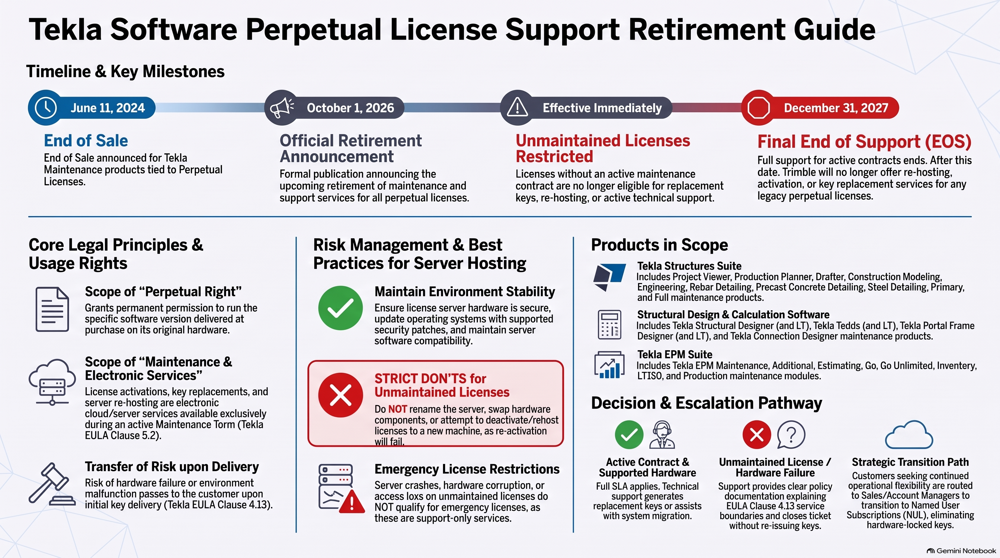
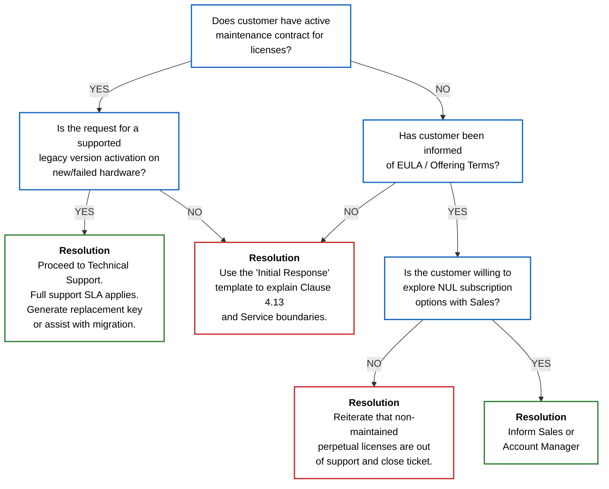

# Policy Update: Retirement of Maintenance & Support Services

!!! info "Internal Enablement Session: Friday, Sept 25"
    This policy guide is based on the enablement session hosted on **Friday, September 25**. Ahead of the October 1 public rollout, all support team members must align on these policy principles, legal groundings, and decision frameworks.
    
	**Presenters:** Panu Laasonen & Anne Palsala
    
	**Meeting Link / Recording:** [Google Meet ↗️](https://drive.google.com/file/d/1XlBQNMrWu_xonsEecqC_EH5SZYh_1f1Z/view)
    (Note: The event was recorded and distributed for those unable to attend live).



## 1. Announcement Overview

| Event | Date | Status / Impact |
| :--- | :--- | :--- |
| [**Prior Announcement (End of Life)** ↗️](https://www.tekla.com/terms-and-conditions/end-of-life) | June 11, 2024 | <span style="color:green">Completed</span> |
| **Retirement Announcement** | October 1, 2026 | <span style="color:red">Upcoming Rollout</span> |
| **Maintained Licenses (EOL Date)** | Dec 31, 2027 | Final Support Deadline |
| **Unmaintained Licenses** | Immediate | No replacement keys/support |

!!! warning "Executive Insights: Affected Services"
    Trimble will **cease active support** for obsolete/non-supported software versions, license activation services, license re-hosting services, and the provision of replacement keys (e.g., due to hardware failure). This immediately impacts all perpetual licenses without a valid maintenance contract.

---

## 2. Key Milestones & Support Boundaries

| License Status | Support Eligibility | Target End Date |
| :--- | :--- | :--- |
| **With Valid Maintenance** | Eligible for full support, activation, re-hosting, and replacement keys. | **31 December 2027** |
| **Without Valid Maintenance** | Trimble will not issue replacement keys or provide support. | <span style="color:red; font-weight:bold;">Effective Immediately</span> |

!!! warning "Emergency License Restriction"
    * **Policy:** Losing access to an unmaintained license or experiencing server failure does not entitle the customer to an emergency license.
    * **Reasoning:** Providing an emergency license falls under support services, which are unavailable for non-maintained licenses. 
    * **Action:** Adhere strictly to the policy to ensure a consistent customer experience; do not provide exceptions.

### Ceased Services Breakdown (Post-EOS)

<table style="width: 100%; text-align: left; border-collapse: collapse;">
  <thead>
    <tr style="border-bottom: 1px solid #e5e7eb;">
      <th style="padding: 12px; width: 30%;">Service Category</th>
      <th style="padding: 12px; width: 70%; border-right: 1px solid #e5e7eb;">Description of Ceased Action</th>
    </tr>
  </thead>
  <tbody>
    <tr style="border-bottom: 1px solid #e5e7eb;">
      <td style="padding: 12px; font-weight: bold; color: #0063a3;">Activations</td>
      <td style="padding: 12px; border-right: 1px solid #e5e7eb;">No longer processing initial license activations for legacy perpetual software.</td>
    </tr>
    <tr style="border-bottom: 1px solid #e5e7eb;">
      <td style="padding: 12px; font-weight: bold; color: #0063a3;">Re-Hosting</td>
      <td style="padding: 12px; border-right: 1px solid #e5e7eb;">Stopping all license re-hosting services to move licenses between servers.</td>
    </tr>
    <tr style="border-bottom: 1px solid #e5e7eb;">
      <td style="padding: 12px; font-weight: bold; color: #0063a3;">Replacement Keys</td>
      <td style="padding: 12px; border-right: 1px solid #e5e7eb;">No provision of replacement keys in the event of hardware failure or lost licenses.</td>
    </tr>
    <tr>
      <td style="padding: 12px; font-weight: bold; color: #0063a3;">Legacy Support</td>
      <td style="padding: 12px; border-right: 1px solid #e5e7eb;">No active support for obsolete, non-supported software versions.</td>
    </tr>
  </tbody>
</table>

---

## 3. Customer Risk Management

| Recommendation | Action Required |
| :--- | :--- |
| **Server Security** | Ensure license server hardware is secure and up to date. |
| **OS & Patches** | Install the latest available supported OS and security patches to keep the environment stable. |
| **Software Updates** | Keep license server software updated to ensure compatibility with Tekla applications. |

!!! warning "Critical Actions to Avoid (Unmaintained Licenses)"
    If using licenses without a maintenance contract, customers must **NOT**:
    
    1. Deactivate, return, or rehost licenses to a different server machine.
    2. Change hardware components on the server.
    3. Rename the server.
    
    *Every operation that requires activation to different hardware possesses a risk of technical failure.*

---

## 4. Contractual Basis & Liability

| Concept | Definition |
| :--- | :--- |
| **Perpetual Right Scope** | Grants permanent permission to run the specific version delivered at purchase on original hardware. |
| **Contractual Fulfillment** | Delivery is fulfilled on the date the initial license key is made available. |
| **Maintenance Services** | License activation, key replacement, and server re-hosting are electronic services provided *only* during an active Maintenance Term. |

### EULA Clause 4.13 Compliance

!!! info "EULA Clause 4.13: Hardware Risk & Disposal"
    * **Risk Transfer:** Risk of hardware malfunction or installation environment failure passes to the customer upon delivery.
    * **Disposal Requirement:** "When disposing of Equipment in any manner whatsoever, You shall uninstall and remove and ensure that any Authorized Affiliates or Professional Consultants uninstall and remove the Software from such equipment prior to disposal, and take all other steps necessary to prevent the Software or any part thereof from coming into the possession of any third parties".
    * **Liability:** "A failure to do so shall be deemed to constitute breach of this EULA".
    
    [Eula 2021 ↗️](https://www.tekla.com/terms-and-conditions/eula-2021) | [Eula 2024 revB ↗️](https://www.tekla.com/terms-and-conditions/eula)

---

## 5. Support Decision Framework & Escalation Path

<br>
<br>


## 6. Standard Support Response Templates

### Template 1: Initial Response (Hardware Failure/Loss)

```text
Subject: Regarding your Tekla License Activation Request

Dear [Customer Name],

Thank you for reaching out to us regarding your Tekla software license. We understand that you have experienced a hardware failure and are looking to reactivate your perpetual license on new equipment.

After reviewing your account, we have noted that the Maintenance Services for this license expired on [Date].

According to the Tekla End-User License Agreement (EULA) and our Lifecycle Policy:

*   Infrastructure Liability: The responsibility for maintaining the hardware and the environment required to run perpetually licensed software rests with the licensee (EULA Clause 4.13).
*   Service Dependency: Technical services such as license re-hosting, activation, and entitlement resets are provided exclusively as part of an active Maintenance Term (EULA Clause 5.2).

As this license is no longer covered by an active maintenance contract, we are unable to provide a new activation key or reset the entitlement for your new hardware.

Next Steps: While we cannot reactivate the legacy perpetual license, we want to ensure your business remains operational. Our Sales team can provide you with details on our modern Named User Subscription model, which offers greater flexibility, identity-based access (no more hardware-locked keys), and continued software updates.

I have cc'd your Account Manager, [Name], who can discuss transition options with you.

Best regards,

[Your Name] 
Tekla Support
```

### Template 2: Explaining "Perpetual" vs. "Support"

```text
Subject: Clarification on Perpetual License Rights

Dear [Customer Name],

I understand the frustration caused by the current situation. I would like to clarify the distinction between your license rights and the services required to manage them.

A Perpetual License grants you the indefinite right to use the specific version of the software delivered to you at the time of purchase. It is similar to owning a piece of equipment; you have the right to keep and use it.

However, Activation and Re-hosting Services are part of our Maintenance and Support package. These are active electronic services that require Trimble to maintain server infrastructure and provide technical resets. These services are only available while a maintenance contract is in place.

When hardware fails on an unsupported system, the "delivery" of the original contract is considered complete, and the risk for the installation environment has passed to the user (EULA Clause 4.13). Without a maintenance agreement, we do not have a contractual vehicle to provide "re-delivery" to new hardware.

We highly recommend moving to our subscription model to avoid hardware-based lock-ins in the future.

Best regards,

[Your Name] 
Tekla Support
```