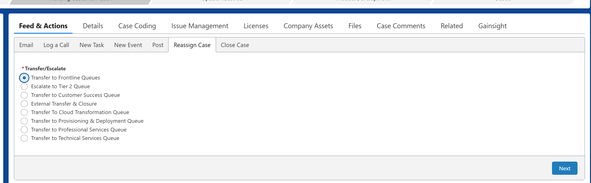

# Reassigning and Escalating Cases

The "Reassign Case" function allows you to move a case to a different team or queue by either transferring or escalating the case.

!!! warning "Important Routing Rule"
    The "Reassign Case" function only works between teams that are already using DX Salesforce. For teams outside of DX Salesforce, traditional methods like email must still be used.

---

## Transfer a Case

<span style="color: #0063A3;">Purpose:</span> A transfer is used to move a case that was assigned to the wrong queue. Common reasons include being sent to the wrong regional queue, the wrong product queue, or if a "Product" case is actually a "General" case.

<span style="color: #0063A3;">How to Transfer:</span>

1. Navigate to the <span style="color: #0063A3;">Reassign Case</span> tab within the case record.
2. Select the option <span style="color: #0063A3;">Transfer to Frontline Queues</span>.
3. Choose the correct queue to send the case to from the provided list.
4. Depending on the queue, you may need to select the Case Product or review an AI-generated summary.
5. Click <span style="color: #0063A3;">Finish</span> to complete the transfer.

{width="100%"}

---

## Escalate a Case (Tier 1 to Tier 2)

<span style="color: #0063A3;">Purpose:</span> An escalation is used to move a case from a frontline (Tier 1) agent to a more skilled Tier 2 support team when higher-level expertise is required to resolve a complex issue. 

Before escalating, it is crucial to understand where to put your escalation notes.

### Case Comment vs. Post (Chatter)

When collaborating on an escalation, always use a <span style="color: #0063A3;">Post</span> rather than a Case Comment.

| Feature | Case Comment | Post (Chatter) |
| :--- | :--- | :--- |
| <span style="color: #0063A3;">Visibility to Customer</span> | Can be made public in the customer portal if the "Public" checkbox is selected. | Not visible to customers by default. Used for internal collaboration. |
| <span style="color: #0063A3;">Purpose/Use</span> | Direct case-related notes (internal or external). Used for escalation notes. | Internal collaboration, sharing files, and tagging colleagues with @ mentions. Essential for case transfers. |
| <span style="color: #0063A3;">Content Capability</span> | Primarily text-based. | Supports rich text, @ tagging colleagues, and attaching files or images. |
| <span style="color: #0063A3;">Location</span> | Found in the "Case Comments" or "Feed & Actions" tab. | Created in the "Feed & Actions" section. |
| <span style="color: #0063A3;">Meaningful Interactions</span> | Included in First Reaction Time (FRT) and Meaningful Interactions calculations. | Not explicitly counted in "Meaningful Interactions," which focuses on emails, calls, tasks, and events. |

---

## GHD Escalation Template

For escalating a case to GHD, please copy the template below and paste it into your Salesforce Post.

```text
Urgency: Critical/High/Medium/Low
Impact: Widespread/Large/Localized/Individualized
Product: TS/TSD/Tedds/PowerFab
Version(s): e.g. 2025
Service pack: e.g. 1
TS Environment/TSD or Tedds Design Code/Country/PF Database: e.g. Default environment or Eurocode
Role & configuration: e.g. All, Full
Operating System/Environment (Exact): e.g. Windows 11, version 24H2
Local Installation or Terminal Service/Citrix:
Server or Client Installation:
Model type: e,g, Single user/Multi-user/Model sharing <applicable for TS only>
Customer: Company Co.
Problem description:
Describe the problem…
Steps to reproduce:
1-2-3
<Also but cannot computer. have if on problem produce tell the tried us you your>
Question:
Is it possible to…
My investigation:
Tried and reproduced with customer model/database.
Searched TUA with keywords “combine dimension”, but found nothing relevant.
No Jira matches.
<Tell all already don’t have need same so the things. to tried, try us we what you>
Links & Attachments:
See attached model, error log, error-report or...
Download model or database from here:
Please find attached customer options.ini file.

```

!!! info "Additional Resources"
	Refer to this Confluence guide for more comprehensive details on the process: 
	[Contacting Global Helpdesk - Support Template](https://confluence.trimble.tools/pages/viewpage.action?pageId=131926146&spaceKey=InstructionsProcesses&title=Contacting+Global+Helpdesk)

## Step-by-Step GHD Escalation Workflow

1. <span style="color: #0063A3;">Create a Detailed Post:</span> Navigate to the case record and click the <span style="color: #0063A3;">Post</span> tab. Paste and fill out the Escalation Template to write a clear summary of the issue, including all troubleshooting steps you've already performed. Attach relevant files like screenshots or log files.
2. <span style="color: #0063A3;">Share the Post:</span> Click the <span style="color: #0063A3;">Share</span> button to add it to the case's history.
3. <span style="color: #0063A3;">Initiate Reassignment:</span> Locate and click the <span style="color: #0063A3;">Reassign Case</span> button in the actions bar.
4. <span style="color: #0063A3;">Select Escalation Path & Product:</span> Choose <span style="color: #0063A3;">Escalate to Tier 2 Queues</span> and select the Tier 2 team (e.g., Americas Product Support, EMEA Product Support). Then, select the specific product associated with the case.

5. <span style="color: #0063A3;">Provide a Case Catch-up Summary:</span> Provide a brief, high-level summary to help the next team quickly understand the reason for the escalation. Click <span style="color: #0063A3;">Next/Finish</span> to complete the process.
6. <span style="color: #0063A3;">Verify the Escalation:</span> Navigate to the <span style="color: #0063A3;">Details</span> tab and verify that the Status is marked as "New" or "Escalated", and the Tier field is updated to "Tier 2". The Case Owner will now be the selected Tier 2 team queue.
7. <span style="color: #0063A3;">Confirm Queue Placement:</span> Confirm that the case appears in the correct team’s queue or on the appropriate dashboard.


!!! note "Note"
	</span> The <span style="color: #0063A3;">Case Product</span> field must be correctly filled out on the case before you can escalate. If it's missing, add it via the <span style="color: #0063A3;">Case Coding</span> tab first. For Trimble Connect, an Escalation Reason is required.

---

!!! note "De-Escalation"
	A Tier 2 agent can de-escalate a case back to Tier 1 if necessary. This reassigns the case to its previous owner and sets the Tier back to "Tier 1".

---

!!! info "Video Guide"
	Watch the video below for a visual walkthrough of the process.
	Open Video Guide directly 
		<br>
	[Google Drive](https://drive.google.com/file/d/1awIf8jrQIJkVtkwa3tu5r9iGpsuO5qtF/preview){ .md-button target="_blank" }