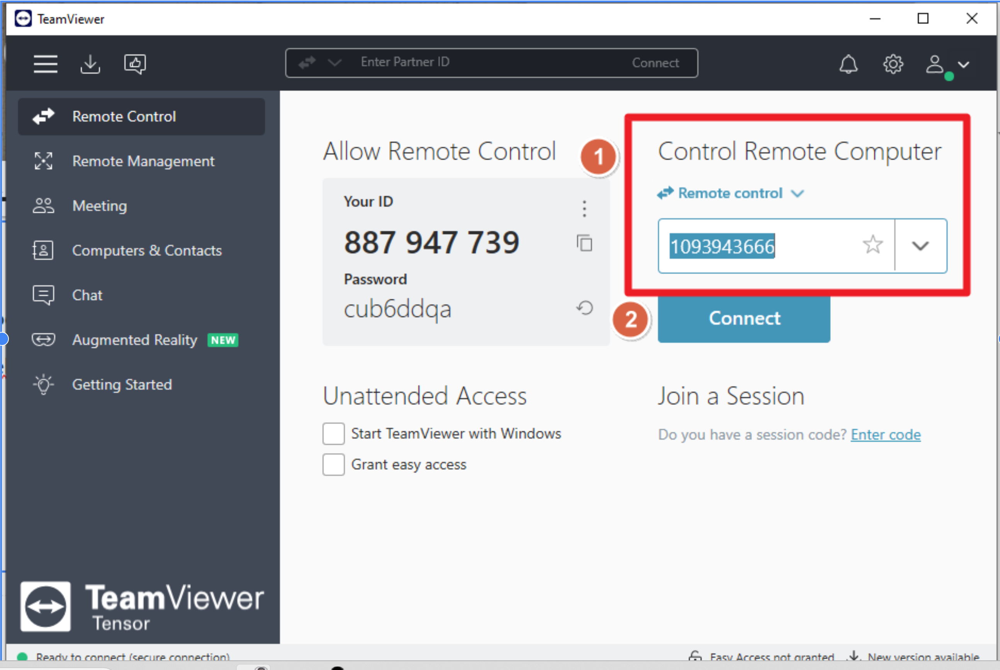

# Remote Support Tools

Guide for using TeamViewer to provide remote assistance to customers.

!!!info "Important"
	**Important:** Please ensure you sign in with your **Trimble ID** to get full access to TeamViewer features before starting a session.

---

    <h2 style="margin: 0; color: #005a8c; font-size: 1.5rem; font-weight: 100; border-bottom: none; padding: 0;">Connection Process</h2>

1. **Share the Connection Link:** Provide the user with the following link to download the QuickSupport module: [https://get.teamviewer.com/tekla](https://get.teamviewer.com/tekla)
2. **Get User ID:** Ask the user to provide the **Your ID** displayed on their TeamViewer window.
3. **Connect to Partner:** Enter the ID in your TeamViewer application and click **Connect**.
4. **Enter Password:** When prompted for a password, enter: **Tekla** (or the specific password generated on the user's screen if different). *Note that the default QuickSupport password for this link is typically set to `tekla`.*

