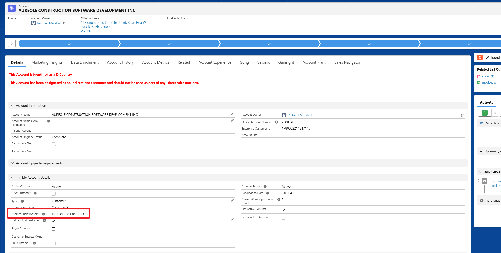
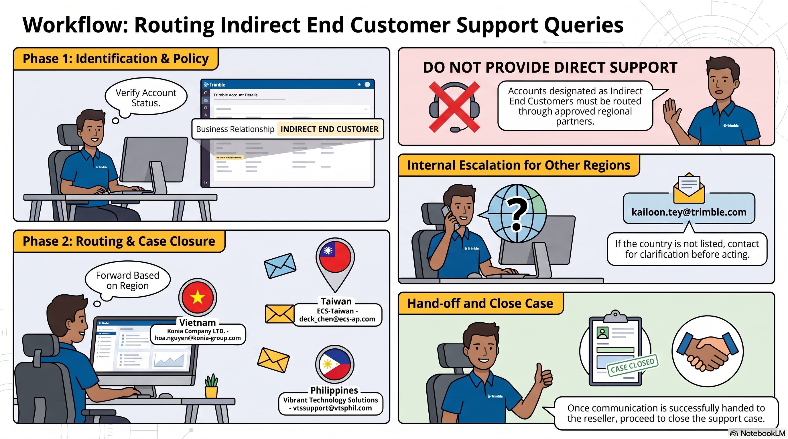

# Reseller Customer Queries

Standard operating procedure for handling and routing support queries originating from Indirect End Customers.

---

## Account Identification

To verify if a customer is a reseller, navigate to the customer's account page, scroll down to expand the **Trimble Account Details** section, and look at the **Business Relationship** field. For resellers, this will be marked as "Indirect End Customer".

**Note the "Business Relationship" field.**

---

!!!info "Regional Reseller Contacts"

	| Region | Partner / Escalation Name | Contact Details |
	| :--- | :--- | :--- |
	| **Vietnam** | **Konia Company LTD.** | **To:** [hoa.nguyen@konia-group.com](mailto:hoa.nguyen@konia-group.com) **CC:** [info@konia-group.com](mailto:info@konia-group.com) |
	| **Taiwan** | **ECS-Taiwan** | **To:** [deck_chen@ecs-ap.com](mailto:deck_chen@ecs-ap.com) |
	| **Philippines** | **Vibrant Technology Solutions** *(Formerly HSD Computers)* | **To:** [vtssupport@vtsphil.com](mailto:vtssupport@vtsphil.com) |
	| **Other Countries** | **Internal Escalation** *(For indirect accounts not listed above)* | **Contact:** [kailoon.tey@trimble.com](mailto:kailoon.tey@trimble.com) |

!!!note "Clarification Required for Unlisted Regions"
	If an account is identified as an Indirect End Customer but the country is **not** Vietnam, Taiwan, or the Philippines, please ensure you contact **[kailoon.tey@trimble.com](mailto:kailoon.tey@trimble.com)** for clarification before forwarding or acting on the query.

---

## Case Handling Workflow

!!!Warning "CRITICAL: Do Not Provide Direct Support"
	Accounts designated as "Indirect End Customer" should not be serviced directly by Trimble Support. Always route them through the approved regional partner matrix before closing the case.

    <h2 style="margin: 0; color: #005a8c; font-size: 1.5rem; font-weight: 300; border-bottom: none; padding: 0;">Standard Procedure</h2>

1. **Verify Account Status:** Locate the customer account in the system and check the **Business Relationship** field. For resellers, this field shall clearly state "Indirect End Customer".
2. **Forward the Query:** Based on the country of the customer, forward the details of the query to the designated regional contact (see the Regional Reseller Contacts table above).
3. **Close the Case:** Once the communication has been successfully handed off to the Reseller, you can safely proceed to close the support case in your queue.