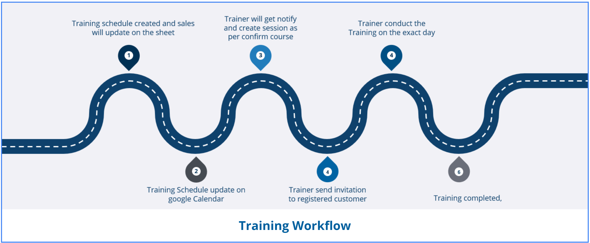

# Training Workflow Overview & Credentials

A comprehensive guide for the TSEA Service Team on managing the end-to-end training process, from invitations to certification.



---

## 1. Invite Participants

Trainers notify and invite participants via email. Ensure they have access to the appropriate enrollment guides before the session begins.

* &rarr; [TS Enrollment Guide](https://sites.google.com/trimble.com/teklastructuretraining/enrollment-setup)
* &rarr; [TSD Enrollment Guide](https://sites.google.com/trimble.com/enrollment-setup-tsd-and-tedds/training-enrollment_1)

## 2. Session Creation & Communication

Create the session on **learn.trimble.com** and send the formal invitation email to the attendees.

!!! info "Email Template: Training Invitation"
    **Subject:** Training Invitation - [Course Name]

    ```text
    We are hereby pleased to invite X engineers from your company to utilize and complete the training entitlement for [Course Name].

    In order to receive the e-Training Kit, each attendee is required to enroll to the designated course using below link as soon as possible:

    E-Learning Link: [Insert Link]

    You may refer to this link on how to enroll and setup: [https://sites.google.com/trimble.com/teklastructuretraining/enrollment-setup](https://sites.google.com/trimble.com/teklastructuretraining/enrollment-setup)

    ** Please note that seats are reserved on a first-come-first-served basis so your early confirmation will allow us to facilitate your participation in the training. Once your enrollment has been approved, your seat is confirmed.
    ```


---

!!!info "Thailand Training Exceptions"

	While the general training workflow follows the basic framework above, there are specific exceptions for Thailand:

	* **Management & Scheduling:** Training invitation, scheduling coordination, and detailed coordination with customers are managed locally by **Wichai and Tawan**.
	* **Direct Contact:** The Thai team manages and schedules the training directly, as they are in direct contact with the customer to obtain the attendee list and coordinate times.

	**Thai-Language Enrollment Guides:**

	* &rarr; [TS Enrollment Guide (TH)](https://sites.google.com/trimble.com/th-ts-trainingenroll/enrollment-setup)
	* &rarr; [TSD Enrollment Guide (TH)](https://sites.google.com/trimble.com/th-tsd-trainingenroll/enrollment-setup)

---

## Training Laptop Credentials

Use the credentials below for training laptops. 

!!! important "🔒 Trimble ID Authentication & License Update Notice"
    Please be advised that **each Trimble ID listed below has now been assigned both a Trimble SEA and a Trimble Malaysia training license.** This consolidated approach streamlines access across our regional training sessions.

    Additionally, due to recent security enhancements involving [Trimble ID Multi-Factor Authentication (MFA)](https://help.trimble.com/doc/trimble-account-services/trimble-account-services/sign-in-and-profile/manage-my-trimble-id-profile/trimble-id-multifactor-authentication), all verification codes and login emails for these training accounts are now routed to a centralized distribution group email address:

    **tekla.training.sea@trimble.com**

    *All team members included in this group will receive MFA notifications simultaneously, ensuring seamless access and preventing bottlenecks during training sessions.*

## SEA & Malaysia Training Licenses

| Gmail & Trimble ID | Password |
| :--- | :--- |
| `Mytraining1a@gmail.com` | `Mytraining@1a@` |
| `Mytraining1b@gmail.com` | `Mytraining@1b@` |
| `Mytraining1c@gmail.com` | `Mytraining@1c@` |
| `Mytraining1dd@gmail.com` | `Mytraining@1dd@` |
| `Mytraining1e@gmail.com` | `Mytraining@1e@` |
| `Mytraining1f@gmail.com` | `Mytraining@1f@` |
| `Mytraining1g@gmail.com` | `Mytraining@1g@` |
| `Mytraining1h@gmail.com` | `Mytraining@1h@` |


!!! tip "Quick Copy"
    Hover your cursor over any `email` or `password` in the table above and click to instantly copy it to your clipboard!

## Additional Resources

For more details on the training framework, please refer to the global structural bookmark:
<br>
&rarr; [Structures Global Training Framework](https://sgmyserviceguide.trimblesea.com/InternalGuide/Structures%20Global%20Training%20Framework%20.html)