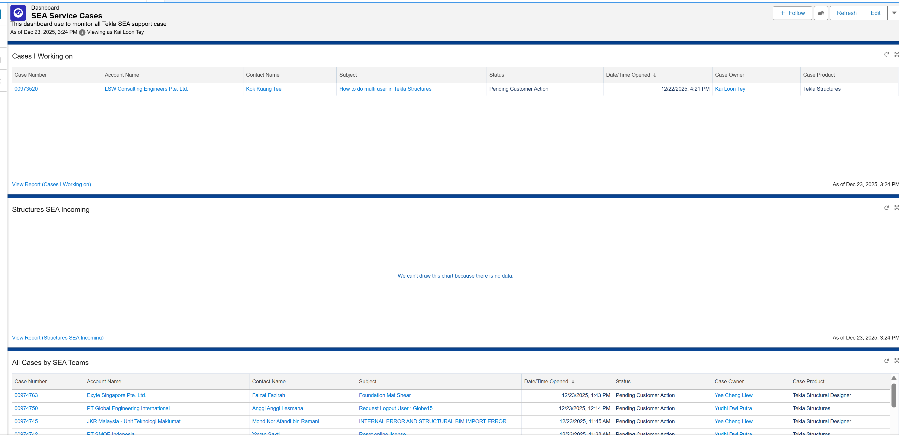

# Working on Cases

This section covers the standard workflow for finding, evaluating, and accepting new support cases from the incoming queue.

---

## Finding Incoming Cases

To locate new cases assigned to your region:

1. From the Service Console, navigate to the **Dashboards** tab.
2. In the folders list, select **Shared with Me**.
3. Click on the **SEA Service Cases** dashboard to view all team-related reports.
4. New, unassigned cases will appear in the **"Structures SEA Incoming Cases"** report.

 

[**Open Salesforce Dashboard &rarr;**](https://trimbledx.lightning.force.com/lightning/r/Dashboard/01ZPO00000KJrZl2AL/view?queryScope=userFolders){ .md-button .md-button--primary target="_blank" }

---

!!! warning "Pre-Acceptance Checks (Critical Steps)"
    Before taking ownership of a case, perform the following checks to ensure the customer is eligible for support:

    * **Check Maintenance Status:** Open the case and go to the **Company Assets** tab. Verify that the customer has an active and valid maintenance or subscription plan.
    * **Check for Account Flags:** Navigate to the **Details** tab and click on the Account Name. Review the account for any negative indicators, such as a **"Non-Pay Indicator"** or **"License Piracy Indicator"**.

---

## Accepting the Case

* If the pre-acceptance checks are clear, return to the case view.
* Click the **Accept** button, which is typically located in the top-right action bar. This will assign the case to you.
* Once accepted, the customer will automatically receive a notification that a team member has been assigned to their case.

---

!!! info "Will the user (customer) see the article?"
    Simply "attaching" an article internally to a case record, or checking the "Article Sent" box, does not automatically make the article visible to the customer. For a customer to see the article:
    
    * **Explicitly Sending a Link:** The support agent must send a customer a link to the article. This action is what the "Article Sent" checkbox tracks for reporting.

!!! note "Quick Close Scenarios"
    If a case is not a valid support request (e.g., sales query, off-maintenance customer, license compliance issue), forward it to the relevant department and use the **Quick Close** action instead of accepting it.