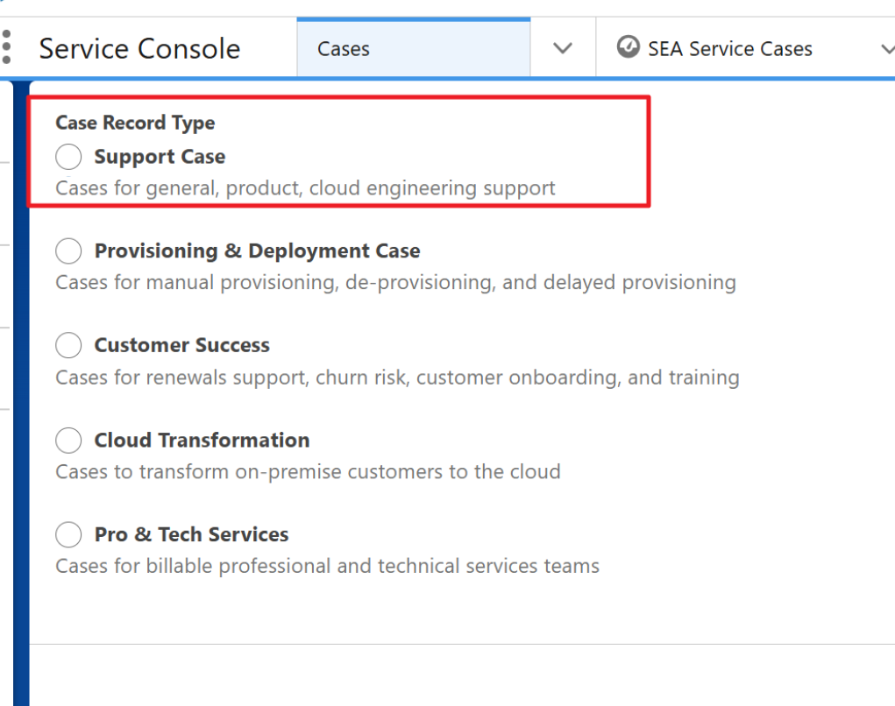

# Creating Support Cases

Standard workflows for finding, evaluating, and managing support cases within Salesforce Service Cloud.

    <h2 style="margin: 0; color: #005a8c; font-size: 1.5rem; font-weight: 300; border-bottom: none; padding: 0;">Steps</h2>

1. **Start the Case:** Click New on the "Cases" tab, or find a Contact and click New Case from their related items.
	
	
	
2. Select Case Record Type as Support Case.

    { width="50%" }

3. **Fill in Key Details:** Fill in all required fields (marked with a red asterisk *). The most important are:
    *   **Contact Name:** Search for or create the customer contact. This confirms their support entitlement.
    *   **Subject & Description:** A brief title and full details of the issue for the customer to see.
    *   **Impact & Urgency:** These determine the case priority (e.g., P1-Critical).
    *   **Support Case:** Choose the category (e.g., Product, General, Issue).
    *   **Case Product:** If "Support Case" is "Product," select the specific product.

4. **Save and Assign the Case:**
    *   **To assign to yourself:** Just click **Save**.
    *   **To assign to a queue:** Check the **Assign using active assignment rule** box before clicking **Save**.

---

!!! info "Important Notes"
    **For Product cases:** You must go to the "Case Coding" tab to add the Product, Application, and Support Category details. This is required to route and close the case correctly.

!!! warning "Update for Manual Cases (WhatsApp, Line, etc.)"
    **Problem:** When manual cases are closed immediately, the "First Response Time" (FRT) is empty, which affects team reports.
    
    **Solution:** Before closing a manual case, please do **one** of the following to log the FRT:
    
    *   📞 **Log a Call Activity:** Add a call log describing the solution given.
    *   ✉️ **Send an Email:** Email the customer the solution from the case. (This also encourages them to use official email support!)

---

    <h2 style="margin: 0; color: #005a8c; font-size: 1.5rem; font-weight: 300; border-bottom: none; padding: 0;">Priority Matrix Logic</h2>

By default, when a case is created, its Impact is set to "Localized" and Urgency is set to "Medium", which will lead to Priority 'P3-Medium' upon creation. Use the matrix below to determine the correct priority.

| Urgency / Impact | Widespread | Large | Localized | Individualized |
| :--- | :---: | :---: | :---: | :---: |
| **Critical** | P1 | P1 | P2 | P2 |
| **High** | P1 | P2 | P2 | P3 |
| **Medium** | P2 | P3 | P3 | P3 |
| **Low** | P4 | P4 | P4 | P4 |